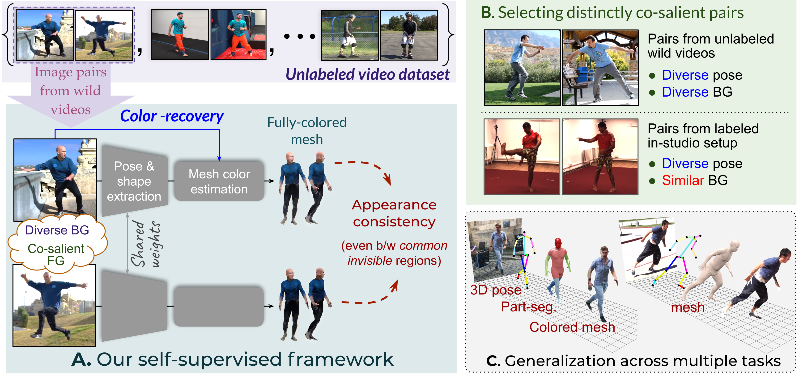

# Appearance Consensus Driven Self-Supervised Human Mesh Recovery
Code repository for the paper:
**Appearance Consensus Driven Self-Supervised Human Mesh Recovery**  
[Jogendra N Kundu](https://sites.google.com/view/jogendra)\*, [Mugalodi Rakesh](https://www.linkedin.com/in/rakesh-mugalodi-179476191/?originalSubdomain=in)\*, [Varun Jampani](https://varunjampani.github.io/), [Rahul M V](https://www.linkedin.com/in/rahul-mysore-venkatesh-64b27380/), [R. Venkatesh Babu](http://cds.iisc.ac.in/faculty/venky/)

ECCV 2020   
[[paper](https://arxiv.org/pdf/2008.01341.pdf)] [[project page](https://sites.google.com/view/ss-human-mesh)]



## Installation 

Clone the repo or download it as a zip from the GitHub GUI.

```
git clone https://github.com/val-iisc/ss_human_mesh.git
```

We have tested the full pipeline on linux with `python2`, hence we suggest you create a `python2` virtual environment and install the relevant pip packages as follows: 

#### Linux Setup:
```
mkdir ./ss_h_mesh_venv
python -m virtualenv ./ss_h_mesh_venv
source ./ss_h_mesh_venv/bin/activate
pip install -U pip
pip install -r requirements.txt
```
Following external packages are required to realize the full pipeline:

1) Install Dirt-renderer from the original repo [here](https://github.com/pmh47/dirt) or from our fork [here](https://github.com/rakeshramesha/dirt_renderer)
	Instructions to install Dirt-renderer can be found on the respective repo pages.

2) SMPL Model
Download the neutral SMPL model from [here](http://smplify.is.tue.mpg.de/) and place it in the `assets` folder.
	```
	cp <path_to_smplify>/code/models/basicModel_neutral_lbs_10_207_0_v1.0.0.pkl assets/neutral_smpl.pkl
	```

Download pre-trained model weights from [here](https://drive.google.com/drive/folders/1Wef_UA1XV5rgSDUIJn7nQT-6-lTvrk7V), extract and place them in the `weights` folder. Check if the weights path matches the path in `config.py`.

```
tar -xvf <path_to_downloaded_file> -C ./weights/
```

## Run demo code
Images should be properly cropped, where the person bounding box is image-centered & scaled to get a bbox size of roughly 180px-200px (along the longer bbox dimension). Also single unoccluded person with full body visible (not truncated) yields best overlays and coloured mesh.

There are 4 ways to run our inference code:
1. Bounding box as a json file along with image, Bbox would be used internally to obtain a proper crop of the image.  
	```
	python demo.py --img_path <path_to_img> --bbox <path_to_bbox_json>
	```
2. OpenPose/CenterTrack detection json file along with image, J2D detections would be used to obtain a proper crop of image. 
	```
	python demo.py --img_path <path_to_img> --j2d_det <path_to_j2d_json>
	```
3. Direct single image inference, Note: Proper crop (as mentioned above) is assumed.
	```
	python demo.py --img_path <path_to_img>
	```
4. Direct webcam inference, person is assumed to be at the center of the feed. All renderings are performed in real-time, including colored mesh and mesh overlays. Note: Although we provide video inference code, we highly recommend use of a person detector in order to feed proper cropped images to the network. Also note that our model is not trained on video data, hence it might exhibit flicking artifacts. 
	```
	python demo.py --webcam <cam_id>
	```
  
## Citing
If you find our work helpful in your research, please cite the following paper:

	@Inproceedings{kundu_human_mesh,
	  Title          = {Appearance Consensus Driven Self-Supervised Human Mesh Recovery},
	  Author         = {Kundu, Jogendra Nath and Rakesh, Mugalodi and Jampani, Varun and Venkatesh, Rahul M and Babu, R. Venkatesh},
	  Booktitle      = {Proceedings of the European Conference on Computer Vision (ECCV)},
	  Year           = {2020}
	}
